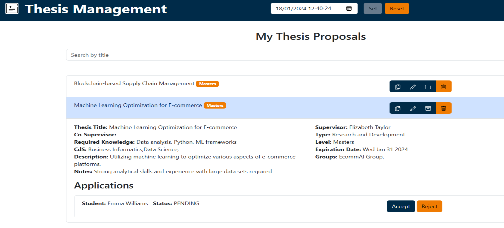
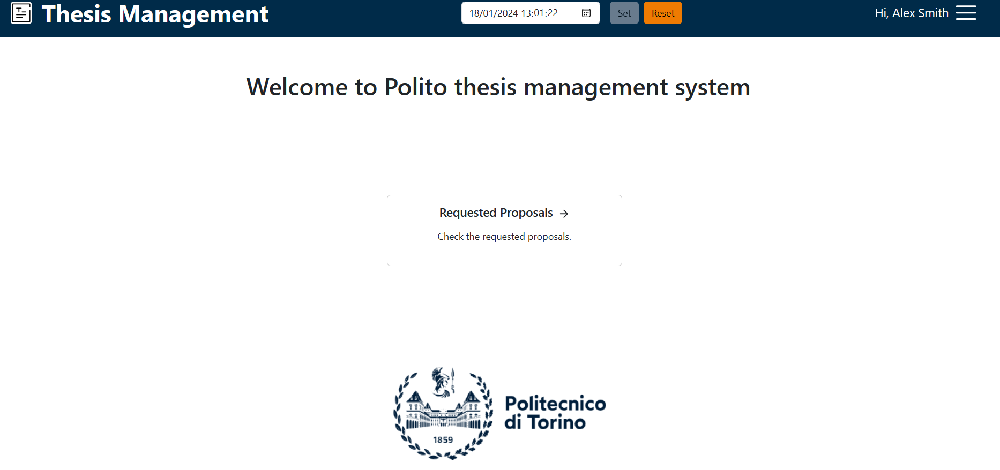
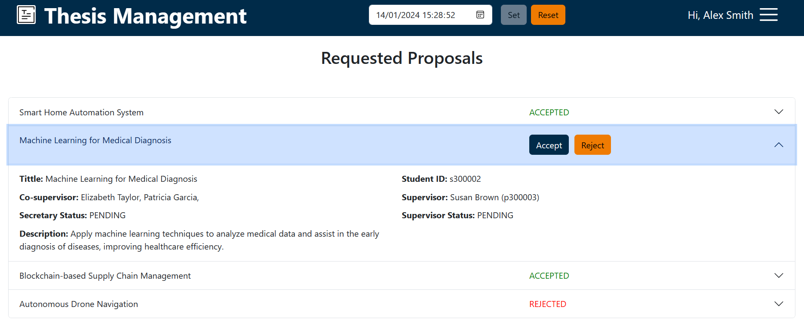

# Front-End Document

## React Client Application Routes

- Route `/`: Main page of the application.
- Route `/login/`: Login page with email and password inputs to log in users.
- Route `/logout`: Uses for logout the user.
### Admin Routes
- Route `/admin/addstudent`: Page of adding a new student.
### Professor Routes
- Route `/browse-proposals`: Page illustrating all the proposals of the professor.
- Route `/browse-applications`: Page of all the applications that registered for each proposal.
- Route `/add-proposal`: Professor can add new proposals through this page.
### Student Routes
- Route `/proposallist`: List of all proposals that have been registered and students can send an application for them.
- Route `/apply/:proposalID`: Page of applying for a specific proposal.
- Route `/myApplicationList`: List of all applications that the student registered and shows their status of them.

## Main React Components

- `App` (in `App.tsx`): The main component to show all pages and navigate users based on role.
- `VC` (in `VC.tsx`): The Virtual Clock component that shows the Virtual Clock, also user can change the clock too.
- `MainNavBar` (in `NavBar.tsx`): The Main Navigationbar component that manages the navigation based on the user's role.
- `NotFound` (in `Layouts.tsx`): Not Found Page component that shows when the user inserts an undefined route.
### Admin Components
- `AdminMain` (in `AdminMain.tsx`): The Main page of admin that contains the list of all students.
- `AdminRoutes` (in `AdminRoutes.tsx`): In this component Navigation bar and the routes of admins are declared.
- `StudentForm` (in `StudentForm.tsx`): Component of adding a new student to the application.
### Guest components
- `GuestMain` (in `GuestMain.tsx`): Main page that users who do not log in will see.

- `GuestRoutes` (in `GuestRoutes.tsx`): Component of the Navigation bar and the routes of guests.
### Login components
- `Login` (in `Login.tsx`): The main component of the Login page that contains all the mandatory components needed for login the user.

### Professor components
- `ProfessorRoutes` (in `ProfessorRoutes.tsx`): This component contains the routes to which the professor has access and also the navigation bar for the professor.
- `ProfessorMain` (in `ProfessorMain.tsx`): The component of the main page that the professor will see after the login.

- `BrowseApplications` (in `BrowseApplications.tsx`): Components that shows all the proposal and gives access to the professor to manage them including checking the applications for each proposal, managing the applications, and modifying or deleting the proposal.

- `ProposalForm` (in `ProposalForm.tsx`): The component that includes a form for adding a new proposal.

- `ArchivedProposals` (in `ArchivedProposals.tsx`): The component of the Archive page that the professor can check the archive proposals through.

- `UpdateProposal` (in `UpdateProposal.tsx`): Component of update and copy the proposals.

### Student components
- `StudentRoutes` (in `StudentRoutes.tsx`): This component contains the student's routes and navigation bar.
- `ProposalList` (in `ProposalList.tsx`): Inside this component, all the proposals will be displayed to the student, also there are filters that students can use to search for specific proposals.

- `StudentApplyForm` (in `StudentApplyForm.tsx`): The component of the applying page for the student.

- `StudentApplicationsListCollapse` (in `StudentApplicationsListCollapse.tsx`): Through this component, the student has the possibility to check the status of all applications he/she sent for each proposal.
### Secretary components
- `SecretaryRoutes` (in `StudentRoutes.tsx`): Component of secretary routes and navigation bar.
- `SecretaryMain` (in `SecretaryMain.tsx`): This component is the main page that the secretary will see after the login.

- `RequestedProposals` (in `RequestedProposals.tsx`): Component of all requested proposals that are registered by students and the secretary can accept or reject them.

