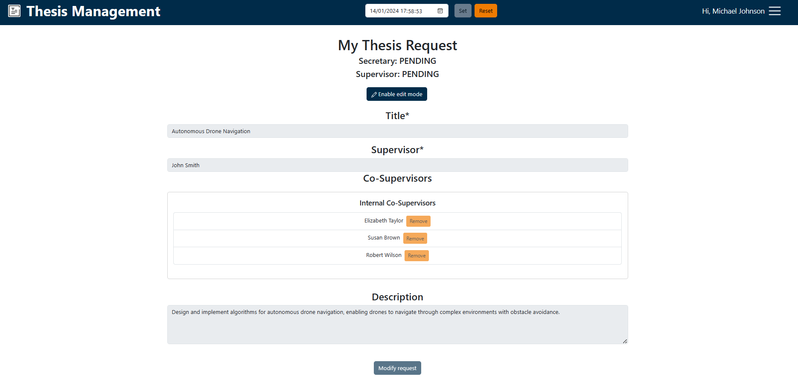
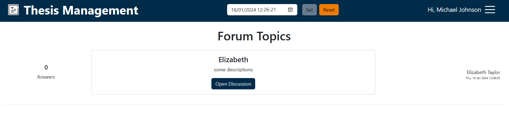
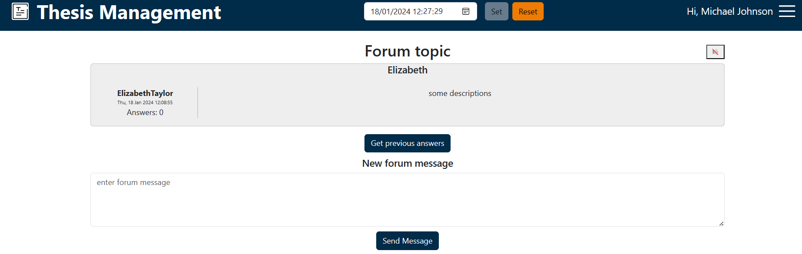
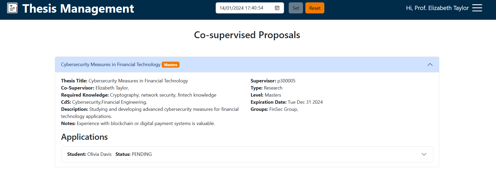
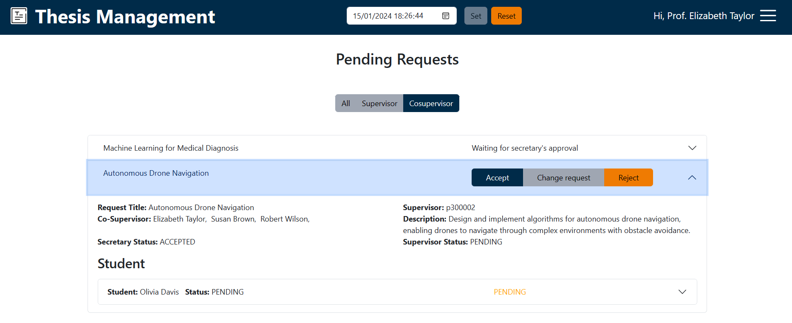
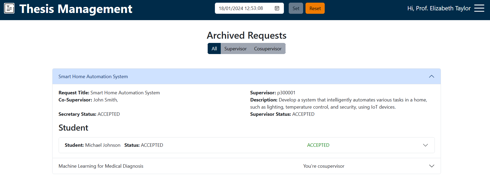
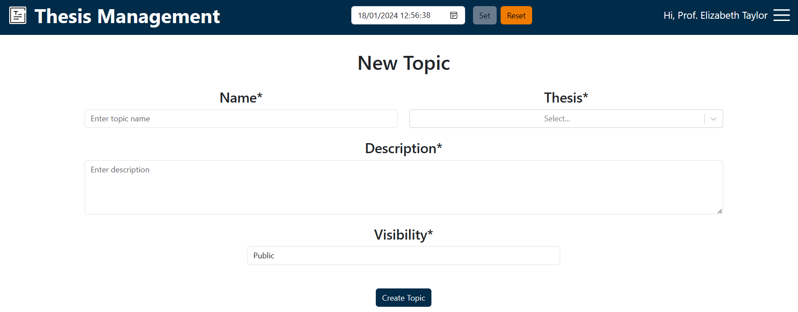

# Thesis Management System Guide

## Table of contents

[//]: # (2. [Prerequisites]&#40;#prerequisites&#41;)

[//]: # (3. [Installation and Execution]&#40;#installation&#41;)
1. [Introduction](#introduction)
2. [Log In](#login)
3. [Virtual Clock](#VC)
4. [Are You A Student?](#student)

   4.1 [Proposal List](#search)
   
   4.2 [Apply For A Thesis Proposal](#apply)

   4.3 [My Applications](#apps)

   4.4 [New Thesis Request](#newthesisrequest)

   4.5 [My Thesis Request](#mythesisrequest)

   4.6  [Forum](#forumstud)
5. [Are You A Professor?](#professor)

   5.1 [Add a new proposal](#add)

   5.2 [My thesis proposal](#props)

   5.3 [Co-supervised Proposals](#cosupervised)

   5.4 [Archive](#archive)

   5.5 [Pending Requests](#pendingrequests)

   5.6 [Archived Requests](#archivedrequests)

   5.7 [Forum](#forumprof)
6. [Are You A Secretary?](#secretary)

   6.1 [Requested Proposals](#requestedproposals)

## 1 Introduction 

Welcome to Polito Thesis Management System, the perfect solution to facilitate the thesis management for
student and professor of Politecnico of Turin.

The software is completely compatible with smartphones and medium size devices.

Let's take a look at the system's features and how to use them.

## 2 Login <a name="login"/>

From the initial page you can log in with one of the following default usernames.

The **password** is the email part before the '@' for all users. For example, if the user email is
**'s100001@studenti.polito.it'** the password will be **'s100001'**

Students usernames:
- s300001@studenti.polito.it
- s300002@studenti.polito.it
- s300003@studenti.polito.it
- s300004@studenti.polito.it
- s300005@studenti.polito.it

Professors usernames:
- p300001@polito.it
- p300002@polito.it
- p300003@polito.it
- p300004@polito.it
- p300005@polito.it

Secretaries usernames:
- secretary01@polito.it

An error alert will arise in case of invalid credentials.

## 3 Virtual Clock <a name="VC"/>

On the bottom of every page you will see the **Virtual Clock**, by default it shows the current date, but you can change
its value opening the calendar and selecting a new date. Click the **"set"** button to confirm the new date. The
**"reset"** button will reinitialize the clock to the current date. The Virtual Clock is used for testing purpose. The
pages will change their data depending on the Virtual Clock value.

## 4 Are You A Student? <a name="student"/>

From the main page you can choose between some options each with its own button which will redirect you to the
appropriate page:

- proposal List
- My Applications
- New Thesis Request
- My Thesis Request
- Forum

In every moment you can change page or logout browsing the **menu** in the top right part of the pages.

### 4.1 Proposal List <a name="search"/>

This page presents on the **list of available proposals** and the **filters board**.

Clicking the **rounded arrow** the list will be updated, maybe the proposal you are searching for has been just added. 

From the filters board you can search a specific proposal typing some keywords or applying some filters (you can select
more than one options for each field).

You can scroll down the list searching for an interesting proposal. Clicking on a proposal you will open a collapsable
window (click another time on the proposal to close it). This window shows the proposal's course of study, the
expiration date and a button that will open a modal containing all the proposal information. From this modal you can
go to the **application page** using the **"Apply"** button.

The button to show the proposal details is disabled in case you already have an 
ACCEPTED or a PENDING application.

### 4.2 Apply For A Thesis Proposal <a name="apply"/>

The application page shows information about you and your university career. The page offers you the possibility to
attach a **PDF document** (your CV for example).

Click the **"Apply"** button at the end of the page to send your application, then you'll get a message based on the
application outcome.

### 4.3 My Applications <a name="apps"/>

In this page you can see your applications with the respective information, especially the **"status"**
that could be:
- PENDING, the proposal supervisor hasn't managed your application yet.
- REJECTED, your application has been rejected by the supervisor.
- CANCELLED, the professor has chosen another applicant, the proposal is expired, or 
it has been archived by the professor so your application has been indirectly rejected.
- ACCEPTED, your application has been accepted by the supervisor.

### 4.4 New Thesis Request <a name="newthesisrequest"/>

If you want to make a **new thesis request** this is the right place. This page offer you the possibility to create a
thesis request compiling a short form with some mandatory fields, the title and the supervisor. Once the form has been
compiled click the submit button to send the request. If you miss one of the mandatory fields you will be warned by some
alert.

Please note: you can have only one thesis request at a time. If you already have a pending or accepted thesis request
and try to create a new one you'll get an error message.

### 4.5 My Thesis Request <a name="mythesisrequest"/>

This page shows your thesis request (if you have one) and gives you the possibility to edit it clicking the button
**"enable edit mode"**, by this way you can modify the request data or delete the request (maybe in order ro create a
new one).

Remember to submit the changes clicking the button **"Modify request"**.

### 4.6 Forum <a name="forumstud"/>

Once your thesis request has been approved by the secretary and the supervisor, the supervisor have the possibility to
create a new topic about the thesis request.

Well, from this page you can interact with the request's supervisor and co-supervisors and open a discussion sending a
message on the **"Forum topic"** page.

## 5 Are You A Professor? <a name="professor"/>

From the main page you can choose between three options each with its own button which will redirect you to the
appropriate page:

- Add A New Thesis Proposal
- My Proposals
- Co-supervised Proposals
- Archive
- Pending Requests
- Archived Requests
- Forum

In every moment you can change page or logout browsing the **menu** in the top right part of the pages.

### 5.1 Add A New Thesis Proposal <a name="add"/>

This page contains the form to add a **new proposal**.

You can add your new thesis proposal filling the form and submitting it.

Pay attention, before you submit the form make sure that the **mandatory fields** (marked with an "*") are filled
otherwise an error alert will arise and the submission won't be accepted. The other fields are all optional.

Note that for some fields like Co-supervisors (internal and external), Research Groups, Keywords, and CdS you can add
**more than one element**.

### 5.2 My Proposals <a name="props"/>

This page displays your thesis proposals and the respective application. From this page you are able to operate on your
personal proposals, in particular you can:
- **delete**
- **edit**, the edit feature consists in a modal working as the "add proposal page"
- **copy**, maybe changing some field before
- **manually archive** 

Clicking the proposals you'll see its applications with the information about the candidate, for each candidate you can
download the attached file. You can **accept** one of the applications, this action will consequently make other
applications cancelled.

Use the search bar above the proposals list to find immediately what you are searching for.

### 5.3 Co-supervised Proposals <a name ="cosupervised"/>

Here you will find all the proposals where you are assigned as a co-supervisors. This is a read-only page.

### 5.4 Archive <a name ="archive"/>

All the expired, manually archived and assigned proposals go here.

Each proposal has a modify button which permits you to edit and then restore an archived proposal.

Use the search bar above the proposals list to find immediately what you are searching for.

### 5.5 Pending Requests <a name ="pendingrequests"/>

Here you can find the thesis requests made by student in which you take part as supervisor or co-supervisor.

If the secretary has already approved one of the requests you will choose to ACCEPTED
or REJECT or maybe send a message to the student telling him to modify the request.

Filter the list based on your role into the proposal requests using the button group above the list.

### 5.6 Archived Requests <a name ="archivedrequests"/>

The page is almost equal to the one about pending requests, the difference is that here there is the list of your
**archived** thesis request.

Filter the list based on your role into the proposal requests using the button group above the list.

This is a read-only page.

### 5.7 Forum <a name ="forumprof"/>

If you already have accepted one of your students' thesis requests you can create a new topic about these requests.

Click the **"Create new topic"** button to open a form. Compiling and submitting the form (remember to fill the
mandatory fields) you'll create a new topic that could be discussed with the request's co-supervisor and the
respective applicant.

## 6 Are You A Secretary? <a name ="secretary"/>

From the main page at th moment you can choose only one options which will redirect you to the appropriate page:

- Requested Proposals

In every moment you can change page or logout browsing the **menu** in the top right part of the pages.

### 6.1 Requested Proposals <a name ="requestedproposals"/>

You can see all the requested thesis proposals made by the students each with the information about the proposal and the
applicant. From this page you can accept or reject a proposal request.

