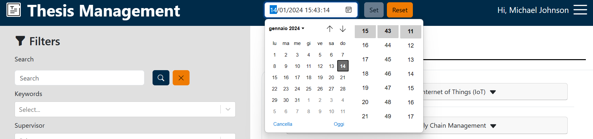
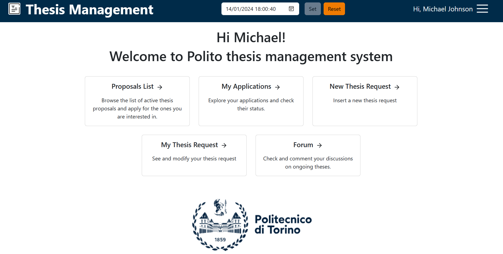
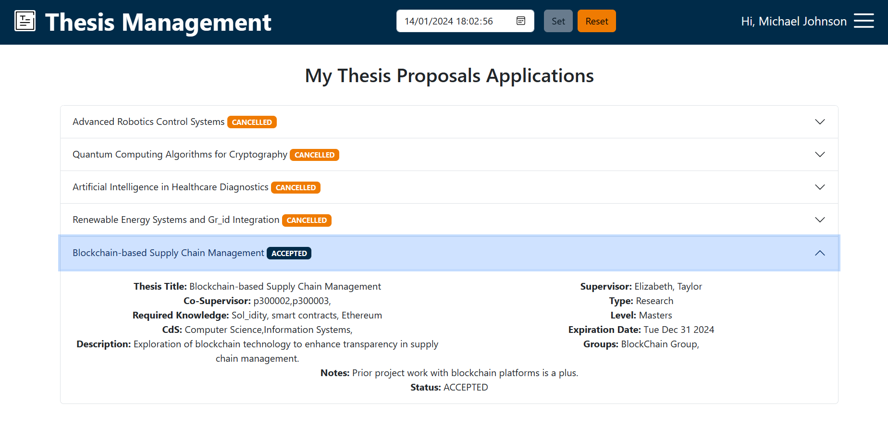
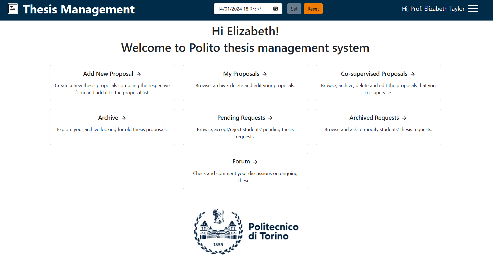

# Thesis Management System Guide

## Table of contents

[//]: # (2. [Prerequisites]&#40;#prerequisites&#41;)

[//]: # (3. [Installation and Execution]&#40;#installation&#41;)
1. [Introduction](#introduction)
2. [Log In](#login)
3. [Virtual Clock](#VC)
4. [Are you a student?](#student)

   4.1. [Search proposal](#search)
   
   4.2. [Apply for a thesis proposal](#apply)

   4.3. [My proposals applications](#apps)
5. [Are you a professor?](#professor)

   5.1. [Add a new proposal](#add)

   5.2. [My thesis proposal](#props)

## 1 Introduction <a name="introduction"></a>

Welcome to Polito Thesis Management System Prototype, the perfect solution to facilitate the thesis management for
student and professor of Politecnico of Turin.

Let's take a look at the system's features and how to use them.

[//]: # (## 2 Prerequisites <a name="prerequisites"></a>)

[//]: # ()
[//]: # (Before you begin, make sure you have installed:)

[//]: # ()
[//]: # (- Docker)

[//]: # (- Docker Compose)

[//]: # (- Node.js and npm)

[//]: # (- JDK &#40;Java Development Kit&#41; version 17 or newer)

[//]: # (- Gradle)

[//]: # ()
[//]: # (Is recommended to use Intellij Idea)

[//]: # ()
[//]: # (## 3 Installation and Execution <a name="installation"></a>)

[//]: # ()
[//]: # (Follow these steps to install and start the system.)

[//]: # ()
[//]: # (Note: Every step should be performed from the project directory using a terminal.)

[//]: # ()
[//]: # (1. To start the containers, run the commands:)

[//]: # (```)

[//]: # (   docker-compose up -d mongoDB)

[//]: # (   docker-compose up -d postgres)

[//]: # (   docker-compose up -d keycloak)

[//]: # (```)

[//]: # (2. To start the server, run the commands:)

[//]: # (``` )

[//]: # (    cd server)

[//]: # (    ./gradlew build)

[//]: # (    ./gradlew bootRun)

[//]: # (```)

[//]: # (3. To start the client, run the commands:)

[//]: # (```)

[//]: # (    cd client)

[//]: # (    npm install)

[//]: # (    npm start)

[//]: # (```)

[//]: # ()
[//]: # (Now you are ready to start! let's take a look at the system's features and how to use them.)

## 2 Login <a name="login"/>

First of all from the initial page you can log in with one of the following default username.

The **password** is "password" for all users, both professors and students.

Students usernames:
- s300001@studenti.polito.it
- s300002@studenti.polito.it
- s300003@studenti.polito.it
- s300004@studenti.polito.it
- s300005@studenti.polito.it

Professors usernames:
- p300001@polito.it
- p300002@polito.it
- p300003@polito.it
- p300004@polito.it
- p300005@polito.it

An error alert will arise in case of invalid credentials.


## 3 Virtual Clock <a name="VC"/>

On the bottom of every page you will see the **Virtual Clock**, by default it shows the current date, but you can change
its value opening the calendar and selecting a new date. Click the **"set"** button to confirm the new date. The
**"reset"** button will reinitialize the clock to the current date. The Virtual Clock is used for testing purpose. The
pages will change their data depending on the Virtual Clock value.



## 4 Are you a student? <a name="student"/>

From the main page you can choose between two options each with its own button which will redirect you to the
appropriate page:

- Search for a thesis proposal
- My proposals applications

In every moment you can change page or logout browsing the **menu** in the top right part of the pages.



### 4.1 Search for a thesis proposal <a name="search"/>

This page presents on the right side the **list of available proposals** and on the left side the **filters board**.

Under the proposal list there's the **virtual clock**, changing its value the proposal list will show only the available
proposals according to the selected date.

Clicking the **rounded arrow** the list will be updated, maybe the proposal you are searching for has been just added. 

From the filters board you can search a specific proposal typing some keywords or selecting some filters (you can select
more than one options for each field)

You can scroll down the list searching for an interesting proposal. Clicking on a proposal you will open a collapsable
window (click another time on the proposal to close it). This window shows the proposal's course of study, the
expiration date and a button that will open a modal containing all the proposal information. From this modal you can
go to the **application page** using the "Apply" button.


### 4.2 Apply for a thesis proposal <a name="apply"/>

The application page shows information about you and your university career. The page offers you the possibility to
add a **document** (your CV for example).
You can send your application with the "Apply" button at the end of the page, then you'll get a message based on the
application outcome.


### 4.3 My proposals applications <a name="apps"/>

In this page your applications are listed and by clicking them you can see their information, especially the **"status"**
that could be:
- "<span style="color:yellow">PENDING</span>", the proposal supervisor hasn't managed your application yet.
- "<span style="color:red">REJECTED</span>", your application has been rejected by the supervisor.
- "<span style="color:green">ACCEPTED</span>", your application has been accepted by the supervisor.



## 5 Are you a professor? <a name="professor"/>

From the main page you can choose between two options each with its own button which will redirect you to the
appropriate page:

- Add a new thesis proposal
- My thesis proposals
- Archive

In every moment you can change page or logout browsing the **menu** in the top right part of the pages.



### 5.1 Add a new thesis proposal <a name="add"/>

This page contains the form to add a **new proposal**. You can add your new thesis proposal filling the form and
submitting it. Pay attention, before you submit the form make sure that the **mandatory fields** (marked with an "*")
are filled otherwise an error alert will arise and the submission won't be accepted. The other fields are all optional.
Note that for some fields like Co-supervisors, Research Groups, Keywords, and CdS you can add **more than one element**.


### 5.2 My thesis proposals <a name="props"/>

This page displays your thesis proposals and the respective application. From this page you are able to **delete** or
**edit** (the edit feature consists in a modal working as the "add proposal page") all your proposals. Clicking the
proposals you'll see its applications with the information about the candidate. You can **accept** one of the
applications, this action will consequently make other applications rejected.


